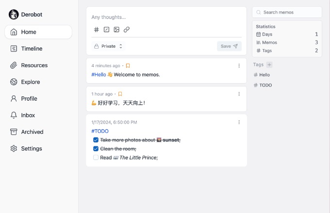

# Memos
## 1. 项目描述

Memos是一项隐私优先的轻量级笔记服务。轻松捕捉并分享您的精彩想法。
- 开源且永久免费。通过我们的开源解决方案拥抱创造力无国界的未来——今天、明天、永远免费。
- 只需几秒钟即可使用 Docker 自托管。享受 Docker 提供的灵活性、可扩展性和易于设置的优势，让您能够完全控制您的数据和隐私。
- 添加了 Markdown 支持的纯文本。告别丰富格式带来的压倒性精神负担，拥抱极简主义方法。
- 轻松定制和分享您的笔记。借助我们直观的共享功能，您可以轻松地与其他人协作和分发您的笔记。
- 用于第三方服务的 RESTful API。借助我们的 RESTful API 支持，拥抱集成的力量并释放新的可能性。



## 2. 项目链接

> https://www.usememos.com/docs/install/self-hosting
> 
> https://github.com/usememos/memos

## 3. 自托管搭建

> 以下数据库组合搭建模式自选其一

- sqlite
```bash
docker-compose up -d
```
- mysql
```bash
docker-compose up -f docker-compose-mysql.yaml -d
```
- postgresql
```bash
docker-compose up -f docker-compose-pg.yaml -d
```
## 4. 使用说明

> https://www.usememos.com/docs/getting-started/memo

- 设置简体中文: settings -> Preferences -> Language